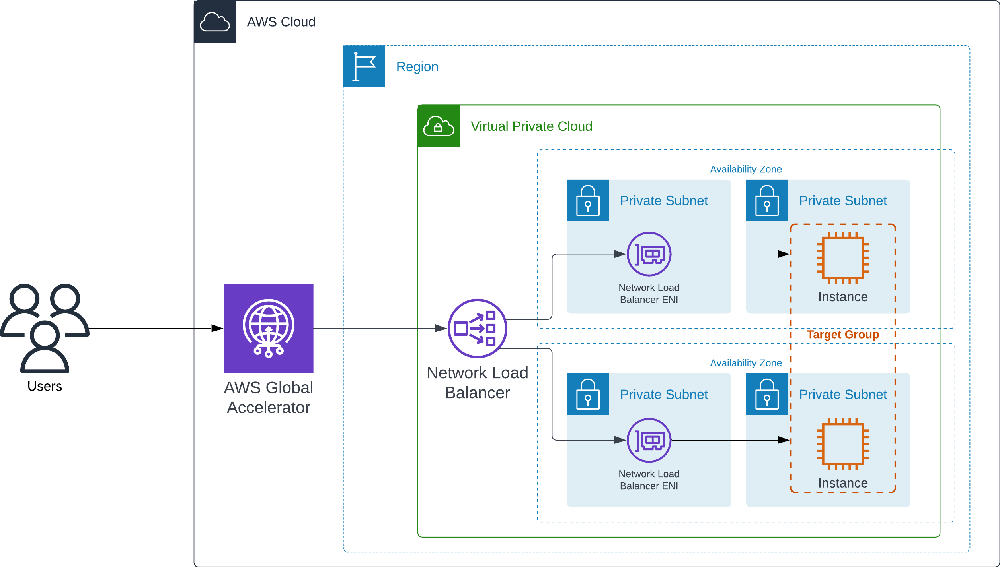

## Configuring client IP address preservation with a Network Load Balancer in AWS Global Accelerator

This repo provides an Amazon CloudFormation template that deploys the architecture described in the following figure (Figure 1).



For more information about setting up and using client IP address preservation with a Network Load Balancer in Global Accelerator, see the following blog post: [Configuring client IP address preservation with a Network Load Balancer in AWS Global Accelerator](https://aws.amazon.com/blogs/networking-and-content-delivery/configuring-client-ip-address-preservation-with-a-network-load-balancer-in-aws-global-accelerator/).

## Prerequisites
- You must have the AWS CLI installed on your local machine.
- You must have the correct IAM permissions to deploy the resources in the CloudFormation template.

## Deployment steps

Use `aws configure` to ensure that you have the correct IAM permissions on your machine. After that, clone the following repo:
```
https://github.com/aws-samples/aws-global-accelerator-client-ip-preservation-nlb
```

Then navigate to the following directory:
```
cd aws-global-accelerator-client-ip-preservation-nlb
```

Finally, deploy the stack by running the following command on your local machine:
```
aws cloudformation create-stack --stack-name aga-sipp-nlb-demo \
   --template-body file://aga_sipp_nlb_cfn_latest.yaml \
   --parameters ParameterKey=AllowedIP,ParameterValue=0.0.0.0/0 \
   --capabilities CAPABILITY_NAMED_IAM \
   --region us-west-2
```

## Cleanup

Run the following command to remove the resources created by the CloudFormation template:
```
aws cloudformation delete-stack --stack-name aga-sipp-nlb-demo  --region us-west-2
```

## Security

See [CONTRIBUTING](CONTRIBUTING.md#security-issue-notifications) for more information.

## License

This library is licensed under the MIT-0 License. See the LICENSE file.

